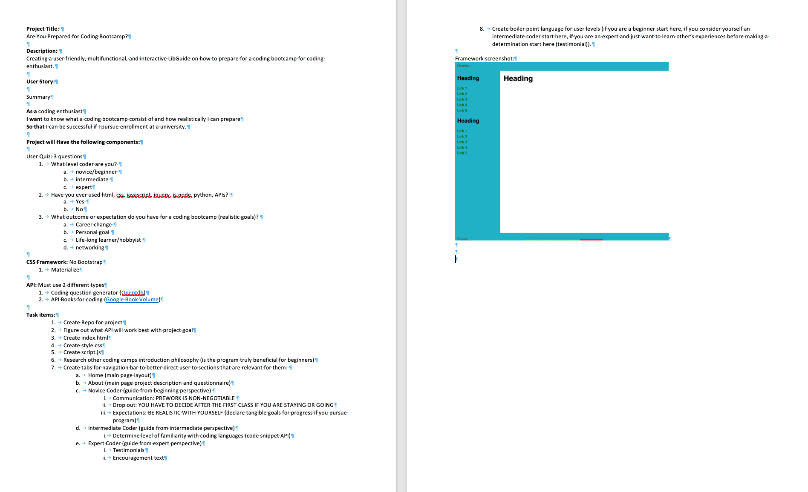
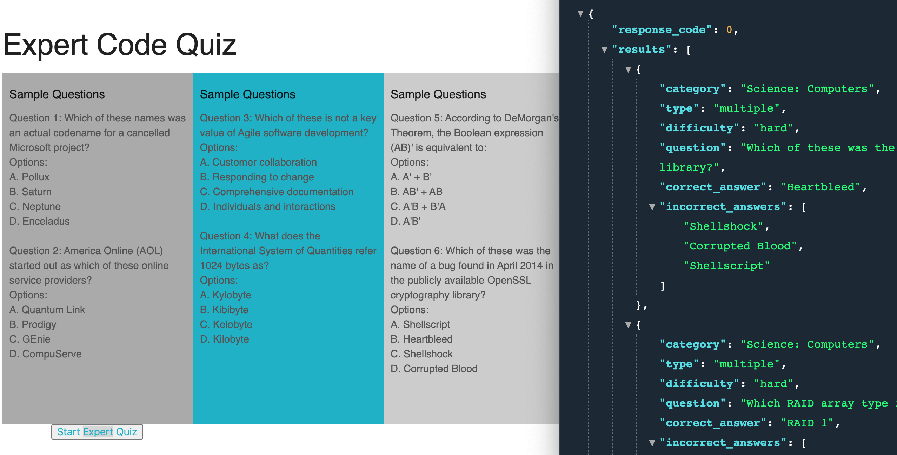

# Project 1 Team 3

# Project Purpose
To create a user friendly, multifunctional, and interactive LibGuide on how to prepare for a coding bootcamp for coding enthusiast.

* This project applies HTMl, CSS, Javascript, Jquery, and API applications. With the use of Javascript, Jquery, and APIs we are able to engage dynamically with the website.

# Demo Features:
* The following image and gif shows the web application's appearance and functionality:

# Live URL:
<a href="https://antonneturner.github.io/Project1-team-3/">Project 1 Team 3 URL Live</a>

<a href="https://github.com/antonneturner/Project1-team-3.git">Project 1 Team 3 GitHub Repo</a>

# Summary
* In this project a LibGuide was created utilizing HTML, CSS, Javascript, and Jquery. Javascript and Jquery are used heavily to create the responsive outputs from coding quiz API and Google Books API.

# Special Features:
* HTML page
  * Index.html
    * Landing with card text box.
* CSS page
  * style.css
    * Materialize framework css stlying on Index.html.
* Javascript page
  * script.js
    * Variables
    * Arrays with objects
    * Jquery language 
    * For loops
    * Functions
  

# Authors
* Shannondale Page (student) <a href="https://github.com/sjohn214">Git Hub Profile</a>
* Antonne Turnner (student) <a href="https://github.com/antonneturner">GitHub Profile</a>
* Mia Dixon (student) <a href="https://github.com/Timia154">GitHub Profile</a>
* Julian Thompson (student)
* Austin Bruch (Bootcamp Instructor)
* Jon Jackson (Bootcamp TA Instructor)
* Luke Boyle (Bootcamp TA Instructor)
* Daniel Sires (Bootcamp Tutor)